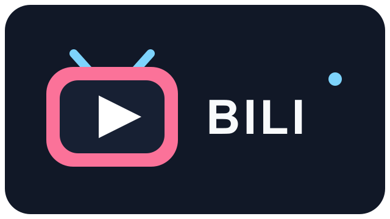
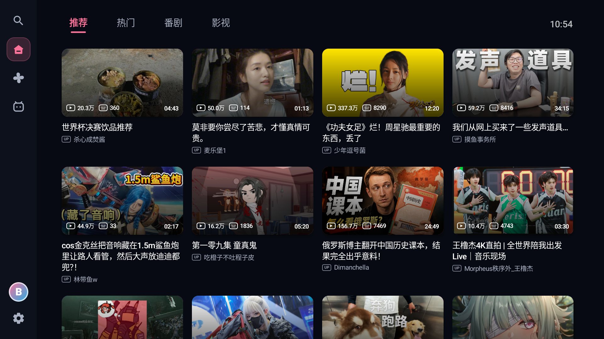
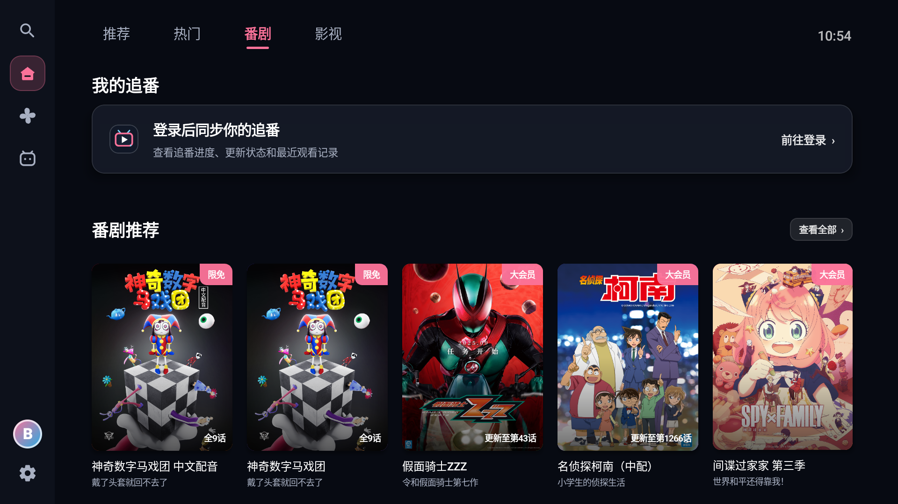
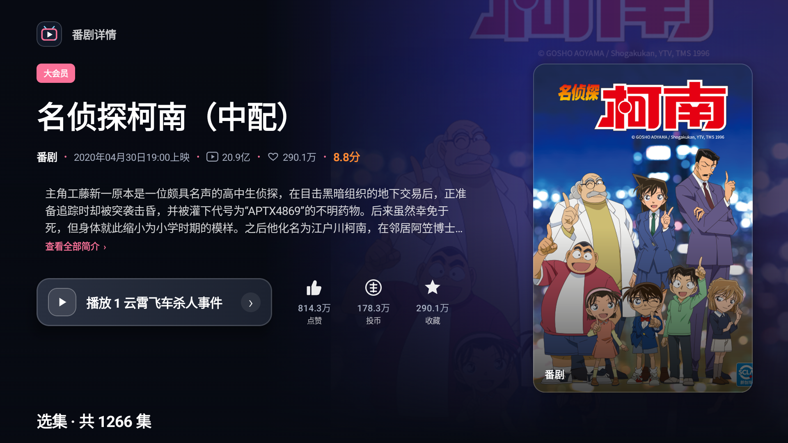
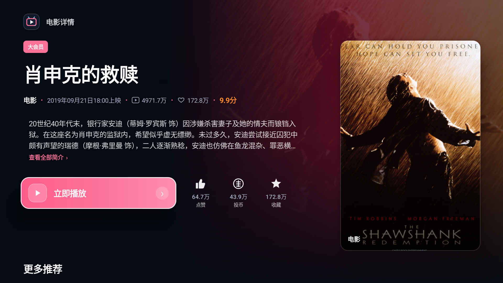
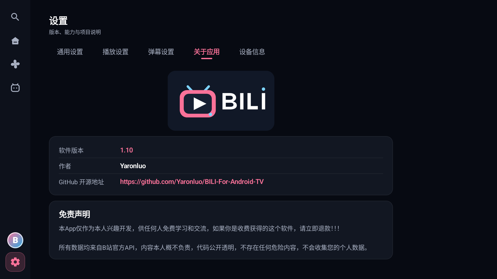

# BILI Android TV

**BILI 是一个由个人维护的非官方 Android TV 第三方客户端，与哔哩哔哩及相关权利方不存在隶属、授权或背书关系。应用免费提供，不包含付费、破解或越权访问功能。当前及后续源代码采用私有闭源方式维护。**

> 注意：本项目不是哔哩哔哩官方客户端。网页端接口可能随时调整；部分影视内容、高清画质和地区限制内容取决于账号权限。请勿分享账号 Cookie。

## 功能

- 适配全画质 Android TV 横屏布局和遥控器方向键焦点导航
- 首页推荐、热门、番剧、国创、电影、电视剧、纪录片和综艺内容
- WBI 签名搜索、热搜、用户和影视搜索结果
- 视频/影视详情、分集、合集、相关推荐与 UP 主主页
- 手机哔哩哔哩扫码登录；**登录凭证仅保存在应用私有数据中**
- 登录后支持动态、追番、观看历史、收藏夹、点赞、投币、收藏和关注
- Media3 在线播放、画质切换、编码回退、音轨选择与播放进度同步
- 弹幕显示、区域/字号/透明度设置，以及官方片头片尾自动跳过
- 缓存限制、启动页面、播放完成行为和设备信息设置
- 设置页手动检查更新；发现公开 APK 仓库的新正式版时在启动后弹窗提醒并显示下载二维码
- 网络、接口、登录过期、CDN 和解码错误提示与重试
- Android 6.0及以上

## 应用截图

## 隐私与数据

- 应用不自建业务服务器，不会把登录 Cookie、搜索历史或本地播放进度上传给开发者。
- 登录 Cookie、设置、搜索历史和本地播放进度保存在 Android 应用私有目录。
- 正式版关闭 Android 系统备份，避免登录 Cookie 随设备备份迁移。
- 清除账号数据或卸载应用会删除本机登录凭证。

## 闭源维护与版权

- 作者：Yaronluo
- 版权所有：Copyright © 2026 Yaronluo
- APK 公开发布地址：https://github.com/Yaronluo/BILI-For-Android-TV
- 源码维护方式：私有闭源仓库
- 当前及后续版本许可：[Proprietary License](LICENSE)

未经版权所有者事先书面许可，不得复制、修改、公开、再发布或销售当前及后续版本的源代码。此前已经按照 Apache License 2.0 公开发布的历史版本继续适用其发布时的许可，已经授予的权利不受本次闭源调整影响。
